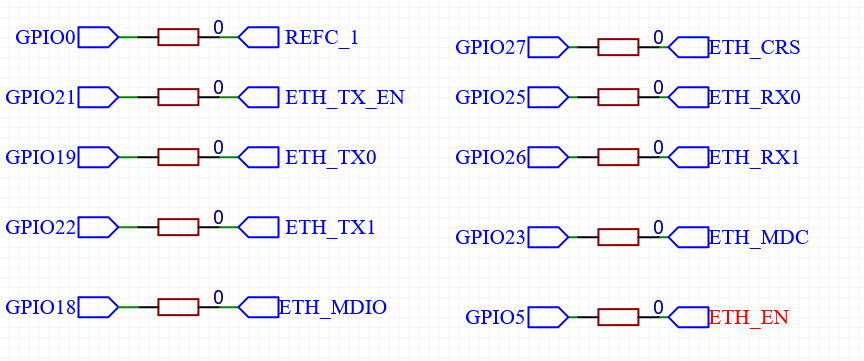

# 说明

本工程为使用[esp-idf](https://github.com/espressif/esp-idf) 进行编程的Demo。整理一些基础功能以快速开发新应用，主要目标soc为ESP32。

## 以太网

ESP32支持以太网需要收发器,本人采用LAN8720作为收发器。对于ESP32连接如下图:



其中REFC_1为以太网时钟,ETH_EN为芯片使能(LAN8720芯片的复位脚)。

## 功能

- 常用网络功能的Kconfig配置(WIFI、以太网)。
- spiffs文件系统(文件读写及编译时生成镜像)。
- tftp服务器,可采用tftp工具在线修改spiffs文件系统的内容。

## 源代码下载

由于本源代码包含第三方源代码,故直接下载可能有部分源代码缺失，需要通过以下方法解决:

- 在进行git clone 使用--recurse-submodules参数。

- 若已通过git clone下载,则在源代码目录中执行以下命令下载子模块:

  ```bash
   git submodule update --init --recursive
  ```

## 资源文件

类似于桌面程序的资源文件。源代码实现的目录为 [main/rc](main/rc/)。

在固件编写中，很多时候需要大量的固定数据，直接手工嵌入到C文件里比较麻烦。

通过读取文件转换到对应C文件可大大节省时间，可添加常用的文件（如各种证书）或者不适宜放在可读写的文件系统中的文件(如需要在格式化中保留或者初始参数)。转换程序源代码为[main/rc/fsgen.cpp](main/rc/fsgen.cpp)。

使用步骤如下:

- 将待添加的文件放入 main/rc/fs目录下。

- 使用文件名调用以下函数(需包含相应头文件RC.h):

  ```c++
  //通过名称获取资源大小
  size_t RCGetSize(const char * name);
  
  //通过名称获取资源指针
  const unsigned char * RCGetHandle(const char * name);
  ```


# 编译

## 编译环境安装

注意:仅支持github.com下载的代码，其他方式下载的代码需要完全按照官方的说明安装。

### Linux / WSL

执行工程目录下的 bootstrap.sh，当提示 初始化完成时 即表示编译环境安装完成。

注意: bootstrap.sh主要用于进入编译环境,执行bootstrap.sh前需保证当前环境能正常使用esp-idf编译例程。每次打开终端后，如需进行工程编译,就需要执行 bootstrap.sh,若未关闭终端,无需重复执行 bootstrap.sh 。

### 其它

进入 [esp-idf](esp-idf/) 目录,安装官方的说明安装。

## 编译说明

环境安装正确后可采用以下方式编译（由SDK提供）：

- 使用CMAKE生成工程文件，再根据工程类型（CMake支持的工程类型，下面均为个人习惯的类型）进行编译：
  - 默认状态下生成可使用make进行编译的工程。
  - 生成codeblocks工程文件，再使用codeblocks编译（编译之前需确定环境变量设置正确）
- ESP IDF支持的方式（idf.py）。

根据平台不同，CMake还可支持nijia/Eclipse CDT等类型。

## ESP-IDF版本

若使用bootstrap.sh安装编译环境,无需注意此提示。

- 已测试分支：master(git version:fa5d0a351343b45ee06d221b7c29028672a4c3c2 )

## 注意

若使用bootstrap.sh安装编译环境,无需注意此提示。

为了精简Kconfig大小，分离了Kconfig文件。因此，除了在需要在esp-idf下执行以下指令，在本工程目录下也需要执行以下指令(若esp-idf安装在默认目录~/esp/esp-idf，只需要在本工程目录下执行):

```bash
source export.sh
```


